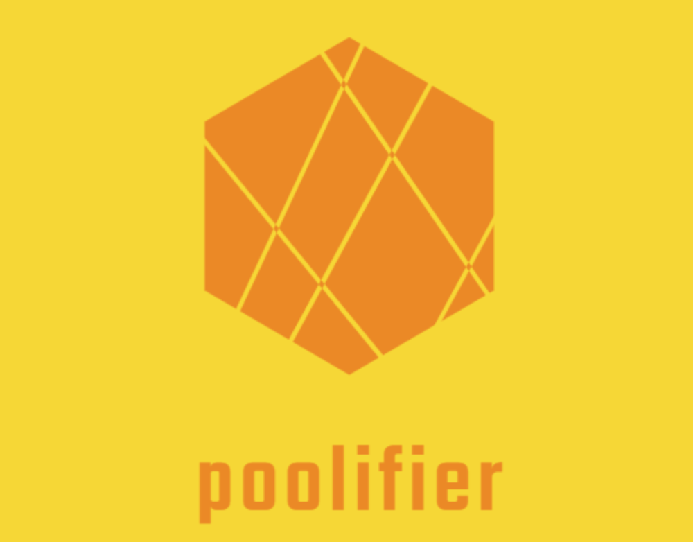

<div align="center">

</div>

<h2 align="center">Node Thread Pool and Cluster Pool :arrow_double_up: :on:</h2>
<h2 align="center">
  <a href="https://ko-fi.com/Q5Q31D6QY">
    </a>
</h2>

<p align="center">
  <a href="https://www.npmjs.com/package/poolifier">
    </a>
  <a href="https://github.com/poolifier/poolifier/actions">
    </a>
  <a href="https://sonarcloud.io/dashboard?id=pioardi_poolifier">
    </a>
  <a href="https://sonarcloud.io/component_measures/metric/coverage/list?id=pioardi_poolifier">
    </a>
  <a href="https://standardjs.com">
    </a>
  <a href="https://gitter.im/poolifier/community?utm_source=badge&utm_medium=badge&utm_campaign=pr-badge">
    </a>
  <a href="https://badgen.net/dependabot/dependabot/dependabot-core/?icon=dependabot">
    </a>
  <a href="http://makeapullrequest.com">
    </a>
  <a href="https://img.shields.io/static/v1?label=dependencies&message=no%20dependencies&color=brightgreen">
    </a>
</p>

## Why Poolifier?

Poolifier is used to perform CPU intensive and I/O intensive tasks on nodejs servers, it implements worker pools (yes, more worker pool implementations, so you can choose which one fit better for you) using [worker-threads](https://nodejs.org/api/worker_threads.html#worker_threads_worker_threads) and cluster pools using [Node.js cluster](https://nodejs.org/api/cluster.html) modules.  
With poolifier you can improve your **performance** and resolve problems related to the event loop.  
Moreover you can execute your tasks using an API designed to improve the **developer experience**.  
Please consult our <a href="#general-guidance">general guidelines</a>

- Performance :racehorse: [benchmarks](./benchmarks/README.md)
- Security :bank: :cop: [](https://sonarcloud.io/dashboard?id=pioardi_poolifier) [](https://sonarcloud.io/dashboard?id=pioardi_poolifier)
- Easy to use :couple:
- Easy switch from a pool to another, easy to tune :heavy_check_mark:
- Dynamic pool size :heavy_check_mark:
- No runtime dependencies :heavy_check_mark:
- Proper async integration with node async hooks :heavy_check_mark:
- Support for worker threads and cluster node modules :heavy_check_mark:
- Support sync and async tasks :heavy_check_mark:
- General guidance on pools to use :heavy_check_mark:
- Widely tested :heavy_check_mark:
- Error handling out of the box :heavy_check_mark:
- Active community :heavy_check_mark:
- Code quality :octocat: [](https://sonarcloud.io/dashboard?id=pioardi_poolifier)
  [](https://sonarcloud.io/dashboard?id=pioardi_poolifier)
  [](https://sonarcloud.io/dashboard?id=pioardi_poolifier)
  [](https://sonarcloud.io/dashboard?id=pioardi_poolifier)
  [](https://sonarcloud.io/dashboard?id=pioardi_poolifier)
  [](https://sonarcloud.io/dashboard?id=pioardi_poolifier)

## Contents

<h3 align="center">
  <a href="#overview">Overview</a>
  <span> · </span>
  <a href="#installation">Installation</a>
  <span> · </span>
  <a href="#usage">Usage</a>
  <span> · </span>
  <a href="#node-versions">Node versions</a>
  <span> · </span>
  <a href="#api">API</a>
  <span> · </span>
  <a href="#general-guidance">General guidance</a>
  <span> · </span>
  <a href="#contribute">Contribute</a>
  <span> · </span>
  <a href="#team">Team</a>
  <span> · </span>
  <a href="#license">License</a>
</h3>

## Overview

Node pool contains two [worker-threads](https://nodejs.org/api/worker_threads.html#worker_threads_worker_threads)/[cluster worker](https://nodejs.org/api/cluster.html#cluster_class_worker) pool implementations, you don't have to deal with worker-threads/cluster worker complexity.  
The first implementation is a static worker pool, with a defined number of workers that are started at creation time and will be reused.  
The second implementation is a dynamic worker pool with a number of worker started at creation time (these workers will be always active and reused) and other workers created when the load will increase (with an upper limit, these workers will be reused when active), the new created workers will be stopped after a configurable period of inactivity.  
You have to implement your worker extending the ThreadWorker or ClusterWorker class

## Installation

```shell
npm install poolifier --save
```

## Usage

You can implement a worker-threads worker in a simple way by extending the class ThreadWorker:

```js
'use strict'
const { ThreadWorker } = require('poolifier')

function yourFunction (data) {
  // this will be executed in the worker thread,
  // the data will be received by using the execute method
  return { ok: 1 }
}

module.exports = new ThreadWorker(yourFunction, {
  maxInactiveTime: 60000,
  async: false
})
```

Instantiate your pool based on your needed :

```js
'use strict'
const { FixedThreadPool, DynamicThreadPool } = require('poolifier')

// a fixed worker-threads pool
const pool = new FixedThreadPool(15,
  './yourWorker.js',
  { errorHandler: (e) => console.error(e), onlineHandler: () => console.log('worker is online') })

// or a dynamic worker-threads pool
const pool = new DynamicThreadPool(10, 100,
  './yourWorker.js',
  { errorHandler: (e) => console.error(e), onlineHandler: () => console.log('worker is online') })

pool.emitter.on('busy', () => console.log('Pool is busy'))

// the execute method signature is the same for both implementations,
// so you can easy switch from one to another
pool.execute({}).then(res => {
  console.log(res)
}).catch ....

```

You can do the same with the classes ClusterWorker, FixedClusterPool and DynamicClusterPool.

**See examples folder for more details (in particular if you want to use a pool for [multiple functions](./examples/multiFunctionExample.js)).**  
**Now TypeScript is also supported, find how to use it into the example folder**.

Remember that workers can only send and receive serializable data.

## Node versions

You can use node versions 12.x, 13.x, 14.x, 16.x

## API

### `pool = new FixedThreadPool/FixedClusterPool(numberOfThreads/numberOfWorkers, filePath, opts)`

`numberOfThreads/numberOfWorkers` (mandatory) Number of workers for this pool  
`filePath` (mandatory) Path to a file with a worker implementation  
`opts` (optional) An object with these properties:

- `errorHandler` (optional) - A function that will listen for error event on each worker
- `onlineHandler` (optional) - A function that will listen for online event on each worker
- `exitHandler` (optional) - A function that will listen for exit event on each worker
- `workerChoiceStrategy` (optional) - The work choice strategy to use in this pool:

  - `WorkerChoiceStrategies.ROUND_ROBIN`: Submit tasks to worker in this pool in a round robbin fashion
  - `WorkerChoiceStrategies.LESS_RECENTLY_USED`: Submit tasks to the less recently used worker in the pool

  Default: `WorkerChoiceStrategies.ROUND_ROBIN`

- `enableEvents` (optional) - Events emission enablement in this pool. Default: true

### `pool = new DynamicThreadPool/DynamicClusterPool(min, max, filePath, opts)`

`min` (mandatory) Same as FixedThreadPool/FixedClusterPool numberOfThreads/numberOfWorkers, this number of workers will be always active  
`max` (mandatory) Max number of workers that this pool can contain, the new created workers will die after a threshold (default is 1 minute, you can override it in your worker implementation).  
`filePath` (mandatory) Same as FixedThreadPool/FixedClusterPool  
`opts` (optional) Same as FixedThreadPool/FixedClusterPool

### `pool.execute(data)`

Execute method is available on both pool implementations (return type: Promise):  
`data` (mandatory) An object that you want to pass to your worker implementation

### `pool.destroy()`

Destroy method is available on both pool implementations.  
This method will call the terminate method on each worker.

### `class YourWorker extends ThreadWorker/ClusterWorker`

`fn` (mandatory) The function that you want to execute on the worker  
`opts` (optional) An object with these properties:

- `maxInactiveTime` - Max time to wait tasks to work on (in ms), after this period the new worker will die.  
  The last active time of your worker unit will be updated when a task is submitted to a worker or when a worker terminate a task.  
  If `killBehavior` is set to `KillBehaviors.HARD` this value represents also the timeout for the tasks that you submit to the pool, when this timeout expires your tasks is interrupted and the worker is killed if is not part of the minimum size of the pool.  
  If `killBehavior` is set to `KillBehaviors.SOFT` your tasks have no timeout and your workers will not be terminated until your task is completed.  
  Default: 60.000 ms

- `async` - true/false, true if your function contains async pieces else false
- `killBehavior` - Dictates if your async unit (worker/process) will be deleted in case that a task is active on it.  
  **KillBehaviors.SOFT**: If `currentTime - lastActiveTime` is greater than `maxInactiveTime` but a task is still running, then the worker **won't** be deleted.  
  **KillBehaviors.HARD**: If `lastActiveTime` is greater than `maxInactiveTime` but a task is still running, then the worker will be deleted.  
  This option only apply to the newly created workers.  
  Default: `KillBehaviors.SOFT`

## General guidance

Performance is one of the main target of these worker pool implementations, we want to have a strong focus on this.  
We already have a bench folder where you can find some comparisons.

### Internal Node.js thread pool

Before to jump into each poolifier pool type, let highlight that **Node.js comes with a thread pool already**, the libuv thread pool where some particular tasks already run by default.  
Please take a look at [which tasks run on the libuv thread pool](https://nodejs.org/en/docs/guides/dont-block-the-event-loop/#what-code-runs-on-the-worker-pool).

**If your task runs on libuv thread pool**, you can try to:

- Tune the libuv thread pool size setting the [UV_THREADPOOL_SIZE](https://nodejs.org/api/cli.html#cli_uv_threadpool_size_size)

and/or

- Use poolifier cluster pool that spawning child processes will also increase the number of libuv threads since that any new child process comes with a separated libuv thread pool. **More threads does not mean more fast, so please tune your application.**

### Cluster vs Threads worker pools

**If your task does not run into libuv thread pool** and is CPU intensive then poolifier **thread pools** (FixedThreadPool and DynamicThreadPool) are suggested to run CPU intensive tasks, you can still run I/O intensive tasks into thread pools, but performance enhancement is expected to be minimal.  
Thread pools are built on top of Node.js [worker-threads](https://nodejs.org/api/worker_threads.html#worker_threads_worker_threads) module.

**If your task does not run into libuv thread pool** and is I/O intensive then poolifier **cluster pools** (FixedClusterPool and DynamicClusterPool) are suggested to run I/O intensive tasks, again you can still run CPU intensive tasks into cluster pools, but performance enhancement is expected to be minimal.  
Consider that by default Node.js already has great performance for I/O tasks (asynchronous I/O).  
Cluster pools are built on top of Node.js [cluster](https://nodejs.org/api/cluster.html) module.

If your task contains code that runs on libuv plus code that is CPU intensive or I/O intensive you either split it either combine more strategies (i.e. tune the number of libuv threads and use cluster/thread pools).  
But in general, **always profile your application**

### Fixed vs Dynamic pools

To choose your pool consider that with a FixedThreadPool/FixedClusterPool or a DynamicThreadPool/DynamicClusterPool (in this case is important the min parameter passed to the constructor) your application memory footprint will increase.  
Increasing the memory footprint, your application will be ready to accept more tasks, but during idle time your application will consume more memory.  
One good choose from my point of view is to profile your application using Fixed/Dynamic worker pool, and to see your application metrics when you increase/decrease the num of workers.  
For example you could keep the memory footprint low choosing a DynamicThreadPool/DynamicClusterPool with 5 workers, and allow to create new workers until 50/100 when needed, this is the advantage to use the DynamicThreadPool/DynamicClusterPool.  
But in general, **always profile your application**

## Contribute

See guidelines [CONTRIBUTING](CONTRIBUTING.md)  
Choose your task here [2.0.0](https://github.com/poolifier/poolifier/projects/1), propose an idea, a fix, an improvement.

## Team

<!-- ALL-CONTRIBUTORS-LIST:START - Do not remove or modify this section -->
<!-- prettier-ignore-start -->
<!-- markdownlint-disable -->

**Creator/Owner:**

- [**Alessandro Pio Ardizio**](https://github.com/pioardi)

**_Contributors_**

- [**Shinigami92**](https://github.com/Shinigami92)
- [**Jérôme Benoit**](https://github.com/jerome-benoit)

## License

[MIT](./LICENSE)
